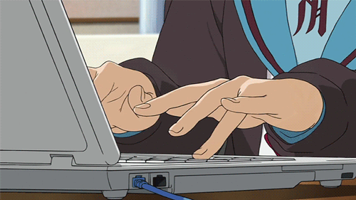
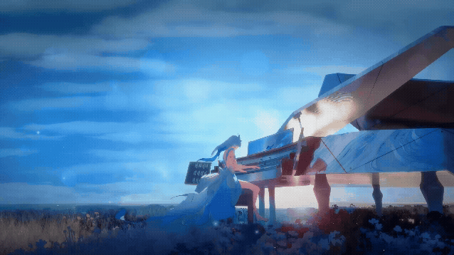

  
    
  

### 🌸 A Little About Me

- 🔭 I’m currently working on **an Android App project 📱**

- 🌱 I’m always learning **new and exciting technologies**

- 👯 I’m looking to collaborate on **fun and creative ideas**

- 💬 Ask me about **tech, design, or anything cute!**

 

### ✨ My Tech Stack

  

### 🐍 Contribution Snake

  <!-- The Snake will be broken in VS Code until you push it to GitHub and run the Action! -->
  <picture>
    <source media="(prefers-color-scheme: dark)" srcset="https://raw.githubusercontent.com/tejaswini3008/tejaswini3008/output/github-contribution-grid-snake-dark.svg">
    <source media="(prefers-color-scheme: light)" srcset="https://raw.githubusercontent.com/tejaswini3008/tejaswini3008/output/github-contribution-grid-snake.svg">
    
  </picture>

### 💌 Let's Connect!

   &nbsp;
  

   
  <i>"Turning coffee into code since forever." ☕</i>

 

  

